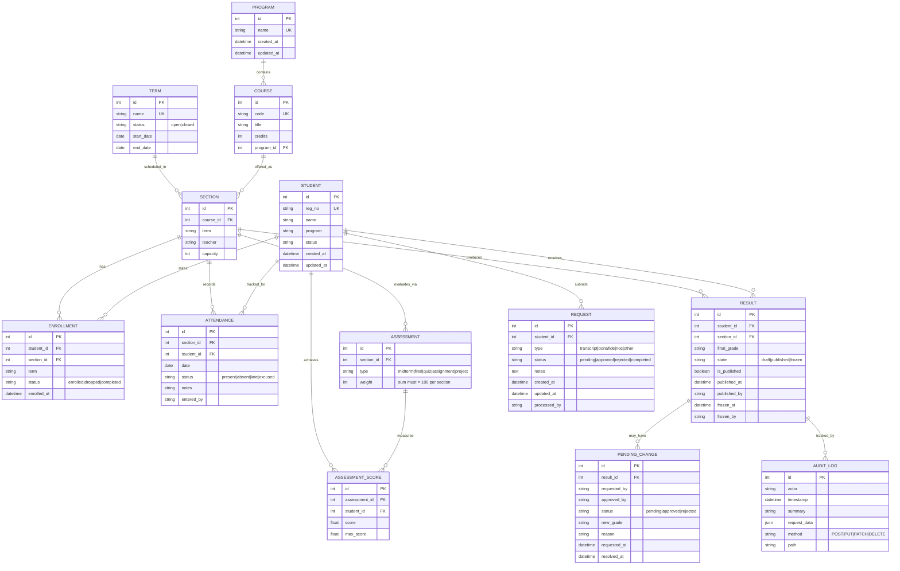

# Data Model (ERD)

## Entity Relationship Diagram



---

## Key Entities & Relationships

### Academic Structure
- **Term**: Academic periods (Fall 2024, Spring 2025) with open/closed status for enrollment control
- **Program**: Degree programs (BS Computer Science, BA English)
- **Course**: Individual courses (CS101 - Intro to Programming)
- **Section**: Specific offering of a course in a term (CS101 Fall 2024, Teacher: Prof. Smith)

### Student Management
- **Student**: Individual student with registration number, program, and status
- **Enrollment**: Links students to sections with term tracking and status
  - Validates capacity constraints
  - Prevents duplicate enrollments
  - Checks term open/closed status

### Assessment & Grading
- **Assessment**: Evaluation components for a section (midterm, final, quizzes)
  - Weights must sum to 100% per section
- **AssessmentScore**: Individual student scores on assessments
- **Result**: Final grades for students in sections
  - **State Machine**: draft → published → frozen
  - Published results require change requests for modification
  - Frozen results are final and immutable

### Change Management
- **PendingChange**: Requests to modify published results
  - Requires approval workflow
  - Tracks requestor and approver
  - Maintains audit trail

### Administrative
- **Request**: Student requests (transcripts, bonafide certificates)
  - Workflow: pending → approved → completed
- **Attendance**: Daily attendance tracking
  - Used for eligibility calculations (75% threshold)
- **AuditLog**: Automatic tracking of all write operations
  - Actor, timestamp, action summary
  - Full request data captured

---

## State Machines

### Result States
```
draft ──publish──> published ──freeze──> frozen
  ↑                    │
  │                    │
  └──(edit allowed)    └──(change request required)
```

### Enrollment States
```
pending ──enroll──> enrolled ──drop──> dropped
                       │
                       └──complete──> completed
```

### Request States
```
pending ──approve──> approved ──process──> completed
   │
   └──reject──> rejected
```

---

## Business Rules

### Enrollment
1. **Duplicate Prevention**: One student cannot enroll in the same section twice
2. **Capacity Constraint**: Section enrollment cannot exceed capacity
3. **Term Validation**: Cannot enroll in sections from closed terms
4. **Term Tracking**: Enrollment records which term it belongs to

### Assessment
1. **Weight Validation**: Sum of all assessment weights in a section must be ≤100%
2. **Score Validation**: Individual scores cannot exceed max_score

### Results
1. **Immutability**: Published results cannot be directly edited
2. **Change Requests**: Published results require PendingChange approval
3. **Dual Approval**: Changes need both requester and approver
4. **Freezing**: Frozen results are final (archival state)

### Attendance
1. **Eligibility**: Students need ≥75% attendance for exam eligibility
2. **Date Uniqueness**: One attendance record per student per section per date

### Transcripts
1. **QR Verification**: Tokens valid for 48 hours
2. **Published Only**: Only include published results
3. **Async Generation**: Can be queued as background job

---

## Finance data model (Phase 2)
- **FeeType**: static list of fee codes and names (e.g., TUITION, EXAM, LIBRARY).
- **FeePlan**: program + term + fee_type + amount + frequency; one active plan per combination.
- **Voucher & VoucherItem**: human-facing invoice grouped by student + term; `total_amount` snapshot and derived from line items.
- **LedgerEntry**: immutable debit/credit lines (reference_type: voucher, payment, adjustment, scholarship, waiver, reversal). Balance is derived, not stored.
- **Payment**: receipt details; verification posts credit ledger entries.
- **Adjustment**: waiver/scholarship/adjustment approvals -> credit ledger entries.
- **FinancePolicy**: gating rules (block transcript/results/enrollment when outstanding exceeds threshold).
- **Finance gates**: transcript and result endpoints consult policies + outstanding balance before serving downloads/results.

## Indexes & Performance

Key indexes for query performance:
- `student.reg_no` (unique)
- `course.code` (unique)
- `enrollment(student_id, section_id)` (unique together)
- `attendance(section_id, student_id, date)`
- `result(student_id, section_id)` (unique together)
- `assessment_score(assessment_id, student_id)` (unique together)

---

## Data Retention

See `DATA-GOVERNANCE.md` for retention policies:
- Active records: Retained indefinitely
- Audit logs: 7 years minimum
- Transcripts: Generated on-demand, not stored long-term
- Backups: 7 days rolling (nightly)
